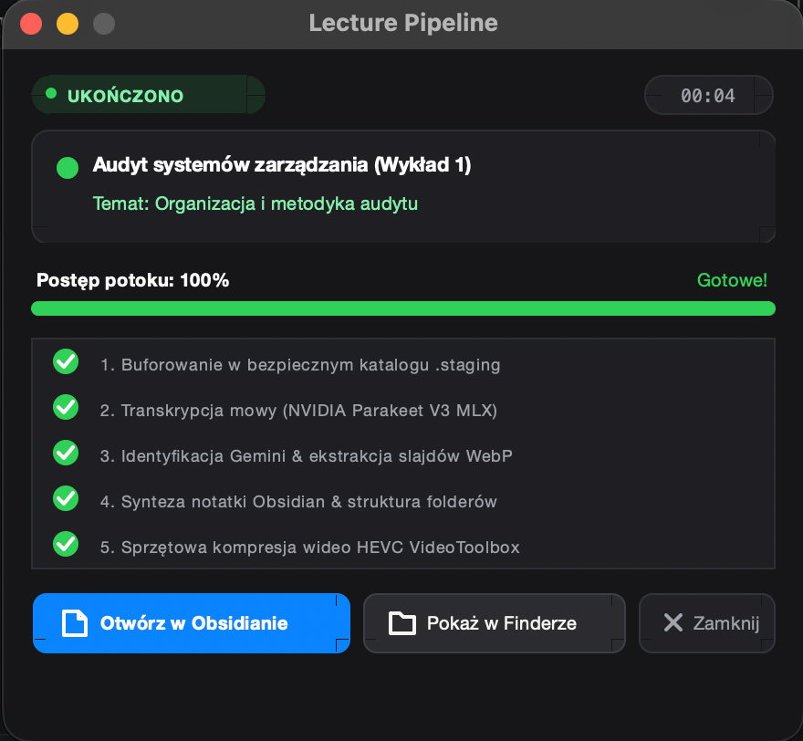
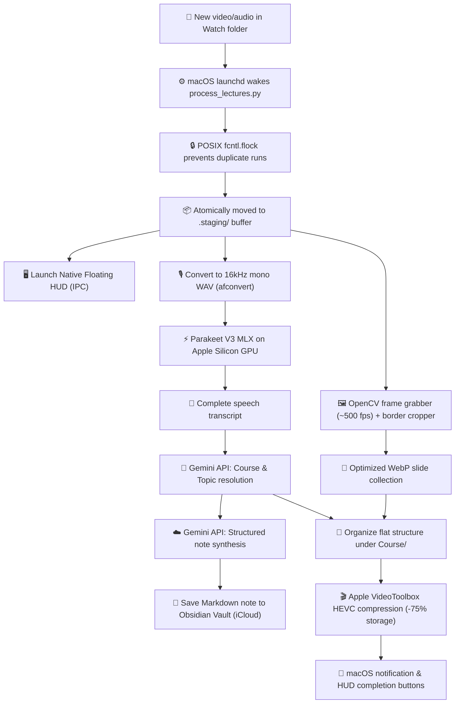

# Lecture Pipeline

<div align="center">

[](https://apple.com)
[](https://python.org)
[-76B900?logo=nvidia&style=flat-square)](https://huggingface.co/nvidia/parakeet-tdt-0.6b-v3)
[](https://ai.google.dev)
[](https://obsidian.md)
[](LICENSE)

**Autonomous multimodal pipeline for academic lectures on Apple Silicon (M1/M2/M3/M4).**  
Transcribes on-device at 15x real-time speed, extracts & crops video presentation slides, synthesizes comprehensive structured notes for Obsidian, compresses video with hardware HEVC (-75%), and streams progress to a native macOS Floating HUD.

[English Documentation](README.md) • [Wersja polska (Polish Documentation)](README.pl.md)

<br/>



</div>

---

## ⚡ Key Highlights

- **🎙️ On-Device Apple Silicon Transcription (MLX)**:
  Runs NVIDIA's **Parakeet TDT 0.6B V3** directly on the unified memory architecture (GPU/ANE). Achieves **~15x real-time transcription** (a 90-minute lecture processes in under 6 minutes) with zero cloud audio upload or API costs.
- **🖥️ Native macOS Floating HUD**:
  Lightweight, always-on-top Tkinter/AppKit status window appearing on file detection. Features a **dual progress bar** (macro pipeline stage + live micro transcription minutes), real-time slide counter, and direct action buttons (*"Open in Obsidian"*, *"Show in Finder"*).
- **🖼️ Computer Vision Slide Extraction**:
  High-throughput OpenCV reader (~500 fps) that detects slide transitions, automatically strips video conference chrome (MS Teams, Zoom, OneNote borders), and saves high-resolution WebP images into a local lecture folder.
- **🧠 Semantic Course & Topic Resolution**:
  Queries Google Gemini with a constrained schema against your existing Obsidian knowledge base (`courses.json` and directory structure) to automatically classify courses, generate clean topic titles, and maintain sequential lecture numbering ($N = \max + 1$).
- **📓 Academic Note Synthesis**:
  Generates rigorous, structured Obsidian Markdown notes with interactive callouts (`[!NOTE]`, `[!WARNING]`, `[!TIP]`), LaTeX formulas, legal/academic citations, and bidirectional `[[wikilinks]]`.
- **🎬 Hardware HEVC Compression**:
  Utilizes Apple's native `VideoToolbox` hardware encoder via `avconvert`, reducing disk footprint by **~75%** without perceivable quality loss.
- **⚙️ Zero-Touch Background Automation**:
  Automated macOS `launchd` service triggers instantly when a recording is dropped into your watch folder. Concurrency-safe via POSIX file locks (`fcntl.flock`) and an isolated `.staging/` buffer.

---

## 🚀 Architecture & Pipeline Flow



---

## 📁 Flat File Organization

All assets for each course are stored flatly inside the course directory, avoiding deep folder nesting:

```text
~/Documents/Wykłady/
├── Corporate Tax Advisory/
│   ├── Lecture 1 - General Tax Rules.mp4           <- Hardware HEVC compressed
│   ├── Lecture 1 - Transcript.md                   <- Full verbatim transcript
│   ├── Lecture 1 - General Tax Rules.md            <- Local mirror note
│   └── slides_L1/                                  <- Local WebP presentation slides
│       ├── slide_001.webp
│       └── slide_002.webp
└── Management Accounting/
    ├── Lecture 1 - Cost Allocation Models.mp4
    ├── Lecture 1 - Transcript.md
    ├── Lecture 1 - Cost Allocation Models.md
    └── slides_L1/
```

Target Obsidian Vault (`~/Library/Mobile Documents/com~apple~CloudDocs/Studia/Notatki/`):
```text
Management Accounting/
├── Course Overview.md
└── Lecture 1 - Cost Allocation Models.md           <- Synced note with wikilinks & callouts
```

---

## 📦 Quickstart & Installation

### 1. Prerequisites
- macOS on Apple Silicon (M1, M2, M3, M4 or later)
- Python 3.11 or 3.12 (Homebrew, Conda, or Python.org)
- Google Gemini API key ([Get a free key at Google AI Studio](https://aistudio.google.com/))

### 2. Clone and Setup Environment
```bash
git clone https://github.com/jwierciak/lecture-pipeline.git
cd lecture-pipeline

# Create and activate virtual environment
python3 -m venv .venv
source .venv/bin/activate

# Install required dependencies
pip install -r requirements.txt
```

### 3. Configure `.env`
```bash
cp .env.example .env
```
Edit `.env` and add your Gemini API key:
```ini
GEMINI_API_KEY="your-gemini-api-key-here"
LECTURE_WATCH_DIR="~/Documents/Wykłady"
OBSIDIAN_VAULT_DIR="~/Library/Mobile Documents/com~apple~CloudDocs/Studia/Notatki"
```

### 4. Install Background Service
Run the automated macOS LaunchAgent installer:
```bash
./scripts/setup_service.sh
```

That's it! Whenever a lecture recording (`.mp4`, `.mov`, `.m4a`, `.wav`) is saved to your watched folder, the pipeline will automatically wake up, process the lecture, display the live HUD, and sync the generated note to Obsidian.

---

## 🔧 Configuration Reference

All settings can be customized in `.env` or system environment variables:

| Variable | Default Value | Description |
| :--- | :--- | :--- |
| `GEMINI_API_KEY` | *(Required)* | Google Gemini API key for semantic matching and note synthesis |
| `LECTURE_WATCH_DIR` | `~/Documents/Wykłady` | Directory monitored for incoming lecture files |
| `OBSIDIAN_VAULT_DIR` | `~/Library/Mobile Documents/com~apple~CloudDocs/Studia/Notatki` | Target Obsidian vault directory |
| `LECTURE_STAGING_DIR` | `./.staging` | Temporary scratch buffer during transcription and encoding |
| `LECTURE_COURSES_FILE` | `./courses.json` | Catalog of known courses for classification fallback |
| `HF_TOKEN` | *(Optional)* | Hugging Face token to suppress unauthenticated model download limits |

---

## 🧪 Testing & Manual Execution

```bash
# Run unit and integration tests
pytest -v

# Preview the macOS HUD interface in test simulation mode
python scripts/progress_window.py --test

# Manually process a single recording
python scripts/process_lectures.py /path/to/lecture.mp4

# Monitor live daemon background logs
tail -f logs/launchd_out.log
```

To uninstall the background daemon:
```bash
./scripts/uninstall_service.sh
```

---

## 🛡️ Privacy & Security

- **Audio stays local**: Speech-to-text is performed 100% on your Mac using MLX. Raw audio is never uploaded to external servers.
- **Slides stay local**: Extracted WebP presentation slides are stored in your local directory and not synced to cloud storage to conserve bandwidth.
- **Minimal LLM payload**: Only the generated textual transcript is passed to Gemini API for synthesis and classification.

---

## 📄 License

This project is licensed under the [MIT License](LICENSE).
