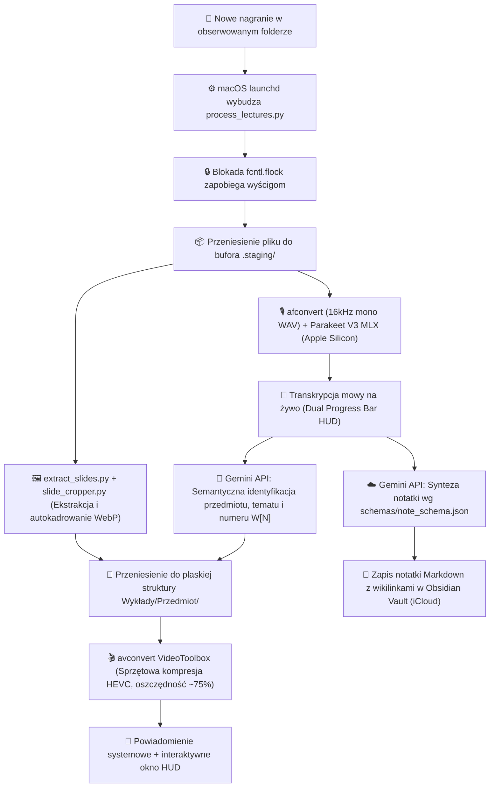

# Lecture Pipeline (Automatyczny Multimodalny Syntezator Wykładów)

[English Version](README.md) • [Dokumentacja PL](README.pl.md)

Autonomiczny, multimodalny potok dla systemu macOS (Apple Silicon) do przetwarzania nagrań wykładów akademickich (audio + wideo ze slajdami), lokalnej transkrypcji ASR z akceleracją sprzętową MLX, semantycznej identyfikacji przedmiotu i tematu przez Google Gemini API, inteligentnej ekstrakcji i autokadrowania slajdów WebP, strukturyzowanej syntezy notatek dla bazy Obsidian (iCloud) oraz sprzętowej kompresji wideo HEVC VideoToolbox.


---

## 🚀 Architektura i Przepływ Danych (Pipeline Flow)



---

## 🛠️ Kluczowe Komponenty i Funkcjonalności

### 1. Pływający HUD Aktywności na Żywo (`progress_window.py` & `gui_tracker.py`)
* **Zawsze na wierzchu (Always-on-top floating HUD)**: Pojawia się w prawym górnym rogu ekranu z dopracowanym, ciemnym motywem macOS w momencie wykrycia nagrania.
* **Podwójny pasek postępu**:
  * Główny pasek (makro): Całkowity postęp potoku (0–100%).
  * Pasek szczegółowy (mikro): Progres transkrypcji mowy w czasie rzeczywistym z odliczaniem minut nagrania (`done / total min`).
* **Aktywne metryki**: Wyświetla na żywo liczbę wykrytych slajdów WebP oraz przetworzony czas wideo.
* **Interaktywne przyciski po ukończeniu**:
  * *„Otwórz w Obsidianie”* – bezpośrednie przejście do nowo zsyntetyzowanej notatki.
  * *„Pokaż w Finderze”* – otwarcie folderu z materiałami wykładu.
  * *„Zamknij”* – okno czeka na decyzję użytkownika bez natrętnego autozamykania.
* **Izolacja IPC**: GUI działa w osobnym procesie; w przypadku zamknięcia okna lub pracy bez ekranu, potok stabilnie kontynuuje pracę w tle.

### 2. Transkrypcja Audio na Apple Silicon (`parakeet-mlx`)
* Model: **NVIDIA Parakeet TDT 0.6B V3** (`mlx-community/parakeet-tdt-0.6b-v3`).
* 100% lokalne przetwarzanie na GPU / Neural Engine w środowisku Apple Silicon (MLX).
* Szybkość: ~15x czas rzeczywisty (wykład 90 min transkrybowany w ~5–6 minut).

### 3. Buforowanie i Ochrona Współbieżności (`.staging/` & `fcntl.flock`)
* **Dedykowany katalog buforowy `.staging/`**: Wszystkie surowe pliki, dane tymczasowe WAV i wstępne pliki transkrypcji trafiają do dedykowanego bufora projektu (`.staging/`). Dzięki temu operacje na plikach tymczasowych nie wyzwalają zdarzeń systemu plików `WatchPaths` w obserwowanym katalogu.
* **Blokada POSIX (`fcntl.flock`)**: Plik `/tmp/lecture_pipeline.lock` zapobiega wielokrotnym równoległym instancjom potoku podczas zapisu lub migracji dużych plików wideo.

### 4. Semantyczna Identyfikacja i Hybrydowa Numeracja (`course_matcher.py`)
* **Ścisłe dopasowanie do kursów**: `get_known_courses()` czyta dynamicznie foldery ze skarbca Obsidiana (`VAULT_DIR`) oraz `courses.json`. Gemini API wybiera właściwy przedmiot z ograniczonej listy.
* **Wyłanianie tematu**: Gemini analizuje początek transkrypcji i formułuje zwięzły temat wykładu (2-5 słów), oczyszczany ze znaków zakazanych w nazwach plików.
* **Hybrydowa numeracja wykładów $N$**:
  * Jeśli wykładowca wprost wypowie numer wykładu w nagraniu $\rightarrow$ pobierany jest `explicit_lecture_number`.
  * W przeciwnym razie potok automatycznie oblicza kolejny numer na podstawie notatek w Obsidianie: $N = \max(\text{istniejące}) + 1$.

### 5. Inteligentna Ekstrakcja i Kadrowanie Slajdów (`extract_slides.py`, `slide_cropper.py`)
* Szybki sekwencyjny odczyt klatek (`OpenCV grab()`) skanuje wideo z prędkością ~500 fps.
* `slide_cropper.py` wykrywa kontury slajdu/tablicy i automatycznie wycina zbędne obramowania okien aplikacji (MS Teams, Word, OneNote, Zoom).
* Slajdy zapisywane są jako **WebP (jakość 75)** wyłącznie lokalnie w `slajdy_W[N]/` (nie obciążają iCloud).

### 6. Strukturyzowana Synteza Notatek (`note_synthesizer.py`, `schemas/note_schema.json`)
* Wymuszone generowanie JSON (`response_schema`).
* Automatyczna obsługa wikilinków `[[...]]`, artykułów prawnych, wzorów i przykładów liczbowych.
* Kaskada modeli: `gemini-3.5-flash-lite` $\rightarrow$ `gemini-3.8-flash` $\rightarrow$ `gemini-3.1-flash-lite` $\rightarrow$ lokalny fallback.

### 7. Sprzętowa Kompresja Wideo (Apple VideoToolbox)
* Wykorzystuje sprzętowy enkoder Apple Silicon (`/usr/bin/avconvert -p PresetHEVC1920x1080`).
* Zmniejsza rozmiar wideo o ~75% (np. z 800 MB do ~180 MB).
* Przed podmianą weryfikuje integralność klatek za pomocą OpenCV i wykonuje atomową podmianę.

---

## 📁 Płaska Struktura Katalogów

W folderze wykładów (`~/Documents/Wykłady/`):
```text
Wykłady/
├── Doradztwo podatkowe/
│   ├── Wykład 1 - Wprowadzenie i podstawowe pojęcia.mp4
│   ├── Wykład 1 - Transkrypcja.md
│   ├── Wykład 1 - Wprowadzenie i podstawowe pojęcia.md  <- lokalna kopia notatki
│   └── slajdy_W1/                                       <- folder slajdów sesji
└── Rachunkowość Zarządcza/
    ├── Wykład 1 - Nakłady, aktywa i pojęcie zysku.mp4
    ├── Wykład 1 - Transkrypcja.md
    ├── Wykład 1 - Nakłady, aktywa i pojęcie zysku.md
    └── slajdy_W1/
```

W skarbcu Obsidian (`iCloud/Studia/Notatki/`):
```text
Rachunkowość Zarządcza/
├── ORG Rachunkowość zarządcza CW.md
└── Wykład 1 - Nakłady, aktywa i pojęcie zysku.md
```

---

## ⚡ Szybki Start (Instalacja)

### 1. Klonowanie repozytorium i instalacja zależności
```bash
git clone https://github.com/jwierciak/lecture-pipeline.git
cd lecture-pipeline

# Utworzenie wirtualnego środowiska (lub użycie Conda)
python3 -m venv .venv
source .venv/bin/activate

pip install -r requirements.txt
```

### 2. Konfiguracja zmiennych środowiskowych
```bash
cp .env.example .env
# Wpisz swój klucz GEMINI_API_KEY w pliku .env
```

### 3. Automatyczna instalacja demona w tle (macOS LaunchAgent)
```bash
./scripts/setup_service.sh
```

Od tej chwili każde nagranie umieszczone w obserwowanym folderze (domyślnie `~/Documents/Wykłady`) zostanie automatycznie przetworzone w tle, a na ekranie pojawi się eleganckie okienko HUD.

---

## 🧪 Testy i Tryb Ręczny

```bash
# Uruchomienie testów jednostkowych
pytest -v

# Podgląd demonstracyjny okna HUD
python scripts/progress_window.py --test

# Ręczne przetworzenie pojedynczego nagrania
python scripts/process_lectures.py /ścieżka/do/nagrania.mp4

# Podgląd logów usługi działającej w tle
tail -f logs/launchd_out.log
```

---

## 📜 Licencja
Projekt jest udostępniany na licencji [MIT](LICENSE).

